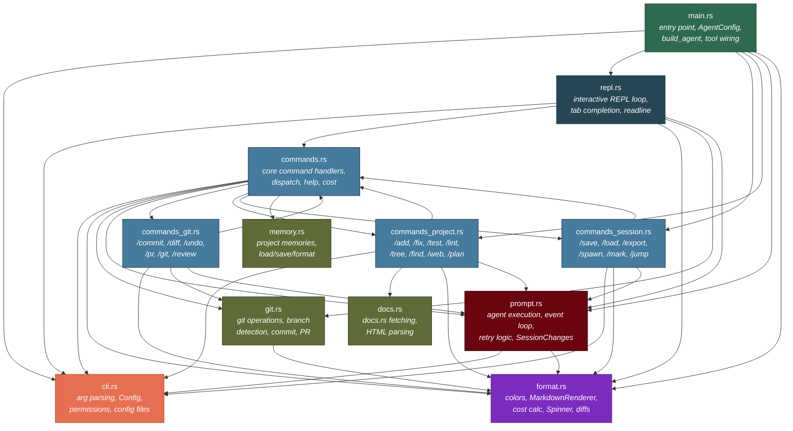
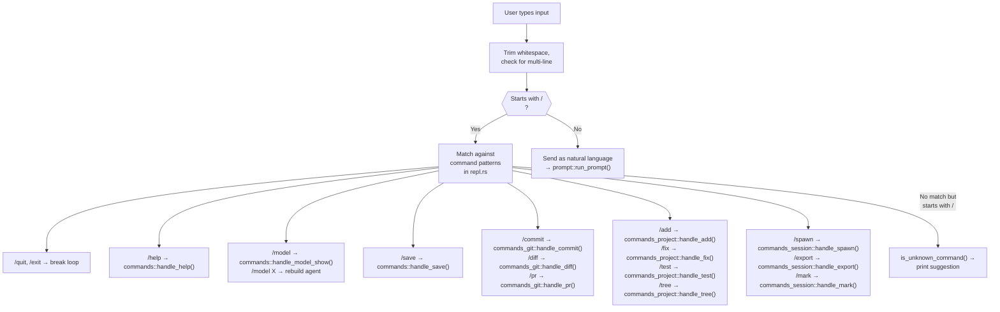
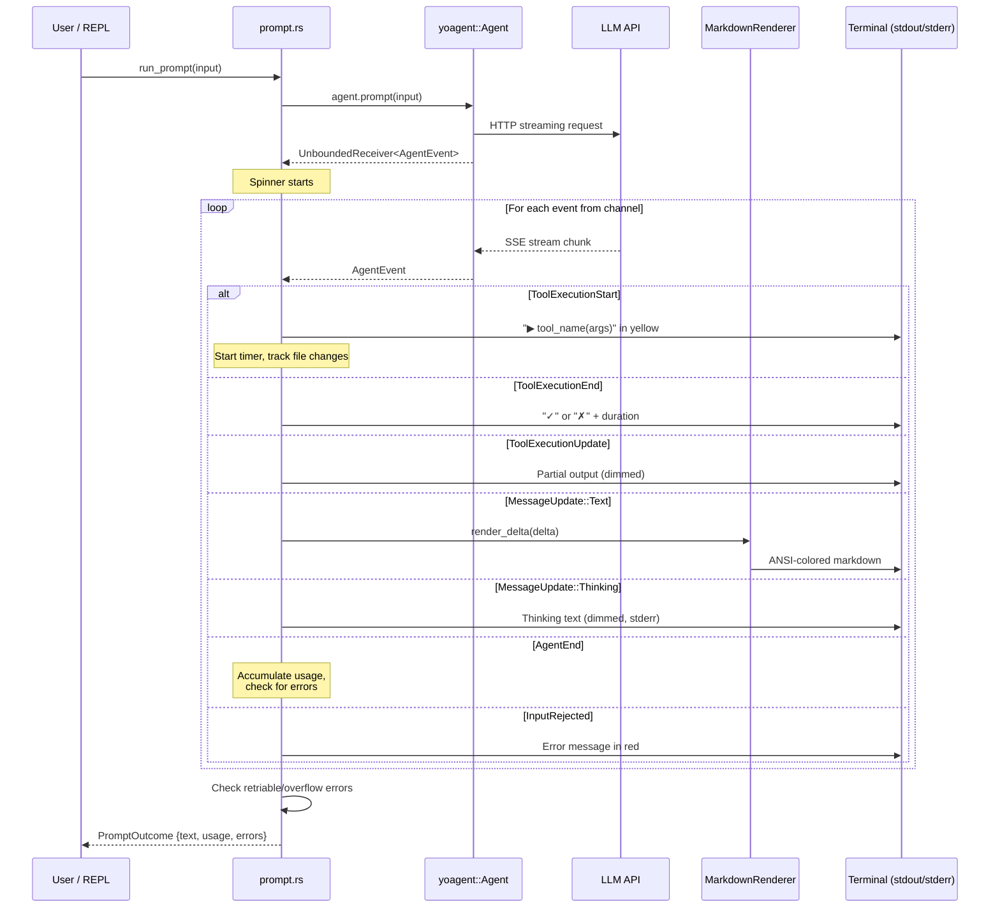

# Architecture

This page maps yoyo's internals — how the source files relate to each other, how user input flows through the system, and how the streaming agent pipeline works. Each section includes a [mermaid](https://mermaid.js.org/) diagram and a brief explanation.

## Module Dependency Graph

The codebase lives in `src/` as a set of focused modules. Here's how they depend on each other:

**Layered design.** The modules form rough layers:

- **Entry layer** — `main.rs` parses args via `cli.rs`, builds the agent, and hands off to `repl.rs` (interactive) or runs a single prompt (piped/`-p` mode).
- **REPL layer** — `repl.rs` owns the readline loop and dispatches `/` commands to handler functions.
- **Command layer** — `commands.rs` is the hub, re-exporting handlers from three sub-modules (`commands_git.rs`, `commands_project.rs`, `commands_session.rs`). Each sub-module groups related commands.
- **Engine layer** — `prompt.rs` runs the agent, processes the streaming event channel, handles retries and context overflow. `format.rs` renders everything to the terminal.
- **Utility layer** — `git.rs`, `memory.rs`, and `docs.rs` are leaf modules with no upward dependencies into the command or REPL layers.

## REPL Command Dispatch

When a user types a `/` command in the REPL, here's how it reaches the right handler:

The dispatch is a single large `match` block in `repl.rs::run_repl()`. Commands that need the agent (like `/fix`, `/spawn`, `/pr`) are `async` and receive a mutable reference to the agent. Pure-display commands (like `/help`, `/tokens`, `/marks`) just print and `continue`.

Anything that isn't a recognized `/` command gets sent to the LLM as a natural-language prompt through `prompt::run_prompt()`.

## Agent Event Pipeline

When a prompt is sent to the LLM, yoyo streams events through a channel. Here's the flow from prompt to terminal:

**Key details:**

- **Spinner** — a background spinner runs until the first event arrives, so the user sees activity during the initial API roundtrip.
- **MarkdownRenderer** — renders streaming text deltas into ANSI-colored output. Handles code blocks with syntax highlighting, headers, bold/italic, and inline code — all incrementally as tokens arrive.
- **File change tracking** — `SessionChanges` records every `write_file` and `edit_file` tool call so `/changes` can show what was modified.
- **Auto-retry** — if a tool fails, the prompt automatically retries up to 2 times with error context. Transient API errors (429, 5xx) retry with exponential backoff. Context overflow triggers auto-compaction.
- **Ctrl+C** — caught via `tokio::select!`, calls `agent.abort()` to cancel the in-flight request gracefully.

## CLI Argument Flow

How command-line arguments become a running agent:

```mermaid
flowchart LR
    args["CLI args<br/>(std::env::args)"]
    config_file[".yoyo.toml<br/>or YOYO.md"]
    parse["cli::parse_args()<br/>→ Config"]
    agent_config["AgentConfig<br/>{model, provider,<br/>api_key, thinking,<br/>permissions, ...}"]
    build["AgentConfig::build_agent()<br/>→ yoagent::Agent"]
    configure["configure_agent()<br/>system prompt, tools,<br/>skills, limits"]
    provider{{"Provider?"}}
    anthropic["AnthropicProvider"]
    google["GoogleProvider"]
    openai_compat["OpenAI-compatible<br/>(OpenAI, OpenRouter,<br/>Ollama, xAI, Groq,<br/>DeepSeek, Mistral, ...)"]
    mcp["Connect MCP servers<br/>(--mcp flags)"]
    openapi["Load OpenAPI specs<br/>(--openapi flags)"]
    mode{{"Mode?"}}
    repl_mode["repl::run_repl()"]
    prompt_mode["Single prompt<br/>→ prompt::run_prompt()"]
    piped_mode["Piped stdin<br/>→ prompt::run_prompt()"]

    args --> parse
    config_file --> parse
    parse --> agent_config
    agent_config --> build
    build --> provider
    provider -->|anthropic| anthropic
    provider -->|google| google
    provider -->|others| openai_compat
    anthropic --> configure
    google --> configure
    openai_compat --> configure
    configure --> mcp --> openapi
    openapi --> mode
    mode -->|"interactive<br/>(stdin is tty)"| repl_mode
    mode -->|"--prompt / -p"| prompt_mode
    mode -->|"piped stdin"| piped_mode
```

**The flow in detail:**

1. **`parse_args()`** in `cli.rs` merges three sources: CLI flags, config file (`.yoyo.toml`), and environment variables. It produces a `Config` struct with every setting resolved.
2. **`main()`** converts the `Config` into an `AgentConfig` (the subset needed to build agents) and calls `AgentConfig::build_agent()`.
3. **`build_agent()`** selects the right provider backend based on the `--provider` flag (defaulting to Anthropic), then calls `configure_agent()` to apply the system prompt, tools, skills, thinking level, and execution limits.
4. **Tool wiring** — `build_tools()` in `main.rs` wraps yoagent's `default_tools()` with permission checks and directory restrictions. If `--yes` is set or the mode is non-interactive, tools auto-approve.
5. **MCP and OpenAPI** — if `--mcp` or `--openapi` flags are present, servers are connected before entering the main mode.
6. **Mode selection** — interactive (REPL), single-prompt (`-p`), or piped mode. The REPL can also resume a previous session with `--continue`.
